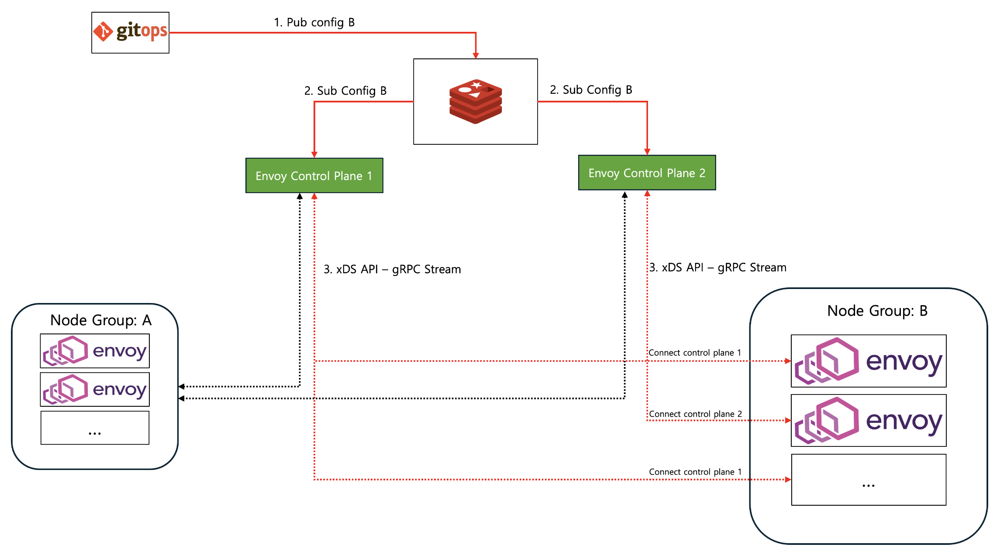
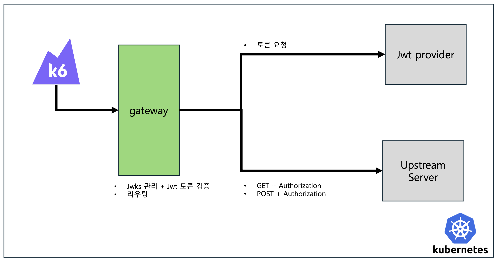

# EnvoyOps

Envoy [xDS protocol](https://www.envoyproxy.io/docs/envoy/latest/api-docs/xds_protocol) 의 구현체인 [java-control-plane](https://github.com/envoyproxy/java-control-plane) 을 사용하여 Envoy 리소스 설정을 동적으로 변경할 수 있게 한다.

- xDS 설정은 redis pub/sub을 통해 Control Plane 으로 전파된다.
- 전파된 설정은 xDS API (gRPC Stream) 을 통해 각 Control Plane에 연결된 envoy 인스턴스로 전달된다.

# Envoy vs Spring Cloud Gateway
Envoy 와 java 진영에서 많이 사용되는 Spring Cloud Gateway Webflux와 성능을 비교한다. 
- Envoy가 Spring Cloud Gateway 보다 2.8배 정도 우수하다.

## 테스트 환경
- 부하 발생기로는 [K6](https://k6.io)을 사용한다.
- kubernetes 환경에서 k6, gateway, jwt-provider, upstream server을 배포 후 테스트를 진행한다.
- 각 시나리오별로 15분동안 부하를 발생시켜서 테스트한다. 오차를 줄이기 위해, 하나의 시나리오를 5번 이상 수행한다.

## 테스트 시나리오
1 iteration에 다음 3가지 요청을 수행한다.
- 클라이언트에서는 Jwt 토큰을 발급받는다.
- 클라이언트에서는 발급받은 토큰과 함께 Post 요청 1개을 수행한다.
- 클라이언트에서는 발급받은 토큰과 함께 Get 요청 1개를 수행한다. 

Gateway 에서는 jwks 을 요청하여 캐시하고 있고, Jwt 토큰을 jwks의 public key로 검증한다. 토큰이 올바른 경우 upstream 으로 요청을 전달한다.

## 테스트 결과
- iter/s, req/s 지표 모두 Envoy가 우수하다.
- 자원 사용량도 Envoy가 적게 사용한다.

### 1Core, 1Gi
|                      | Gateway Pod 리소스 |       iter/s |    req/s    | cpu 사용량 | memory 사용량 |
|:---------------------|:---------------:|-------------:|:-----------:|:-------:|:----------:|
| Spring Cloud Gateway |   1Core, 1Gi    |   700 iter/s | 2,790 req/s |    1    |   492 Mi   |
| Envoy                |   1Core, 1Gi    | 2,000 iter/s | 8,000 req/s |    1    |   48 Mi    |

### 2Core, 2Gi

|       | Gateway Pod 리소스 |       iter/s |    req/s     | cpu 사용량 | memory 사용량 |
|:------|:---------------:|-------------:|:------------:|:-------:|:----------:|
| Spring Cloud Gateway   |   2Core, 2Gi    | 1,400 iter/s | 5,600 req/s  |    2    |    2 Gi    |
| Envoy |   2Core, 2Gi    | 4,000 iter/s | 16,000 req/s |    2    |   252 Mi   |